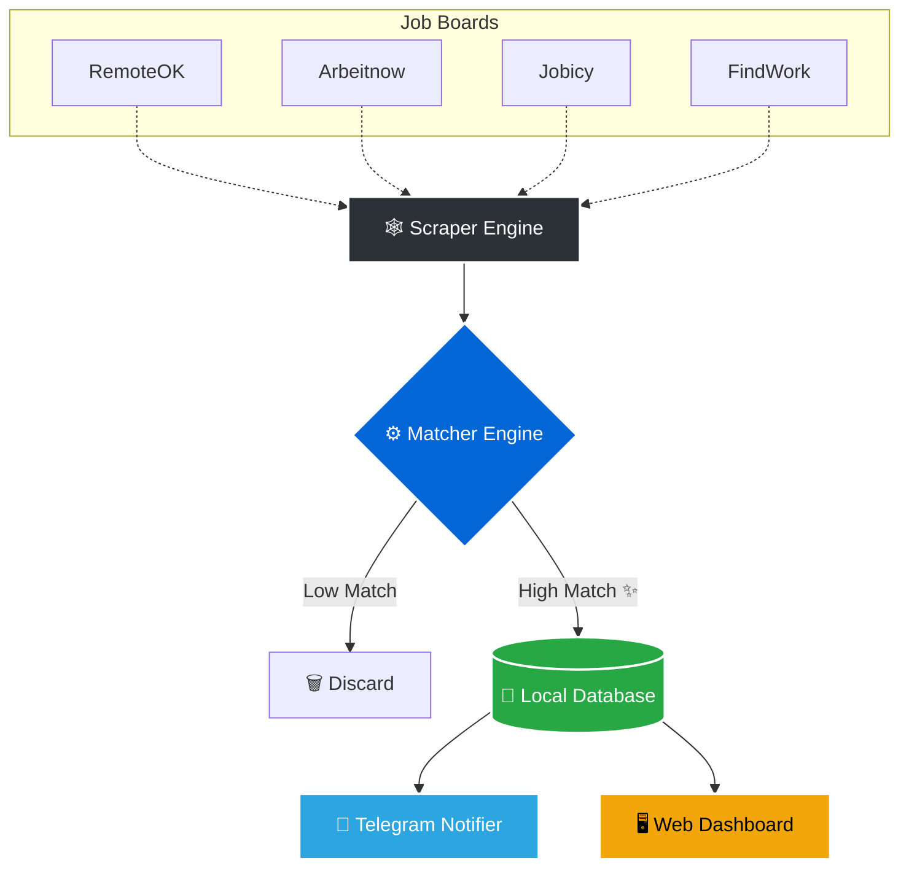

<div align="center">
  
  # 🎯 AI Job Hunter 🚀
  
  **Your Personal, 24/7 Automated Talent Agent**

  [](https://www.python.org)
  [](https://core.telegram.org/bots)
  [](https://opensource.org/licenses/MIT)

  > *Stop scrolling endlessly through job boards. Let AI find, score, and deliver the perfect jobs directly to your phone.*

</div>

---

## ✨ Why AI Job Hunter?

Looking for a job shouldn't be a full-time job. AI Job Hunter works while you sleep:
- 🕷️ **Scrapes** top job boards automatically.
- 🧠 **Analyzes** job descriptions against your unique skills & resume.
- 📱 **Alerts** you instantly on Telegram with high-matching roles.
- 📊 **Organizes** everything in a beautiful, local web dashboard.

---

## 🏗️ Architecture & Workflow

Here is a visual breakdown of how the magic happens:



---

## 🛠️ Features Detailed

<details>
<summary><b>🕵️‍♂️ Automated Job Scraping</b> <i>(Click to expand)</i></summary>
Pulls fresh job listings periodically from trusted developer job board APIs (RemoteOK, Arbeitnow, Jobicy, and FindWork). Never miss an opportunity!
</details>

<details>
<summary><b>🎯 Skill-Based AI Matching</b> <i>(Click to expand)</i></summary>
Uses intelligent regex boundary tracking and keyword analysis to compare job descriptions directly to your configured technical skills. Gives every job a relevance percentage score!
</details>

<details>
<summary><b>💬 Instant Telegram Notifications</b> <i>(Click to expand)</i></summary>
When an 80%+ match is found, your personal Telegram bot buzzes you with the role, salary (if available), and a direct apply link.
</details>

<details>
<summary><b>📈 Interactive Frontend Dashboard</b> <i>(Click to expand)</i></summary>
A clean local tracking UI (`dashboard/index.html`). Filter by "Remote", search by title, and quickly visualize your active job pipeline securely on your own device.
</details>

---

## 🚀 Quick Start Guide

### 1️⃣ Prerequisites
- **Python 3.8+** installed
- A **Telegram Bot Token** (Get it free via [@BotFather](https://t.me/BotFather))

### 2️⃣ Installation
Grab the code and install dependencies:
```bash
git clone https://github.com/Diwakar-odds/Ai_Job_Hunter.git
cd Ai_Job_Hunter
pip install -r requirements.txt
```

### 3️⃣ Configuration
Copy `config.example.yaml` to `config.yaml` and add your details!
```yaml
# Add your Bot token:
telegram:
  bot_token: "YOUR_TELEGRAM_BOT_TOKEN"
  chat_id: "" # Leave blank; it will auto-detect when you text the bot!

# Add your target skills:
search:
  keywords: ["Python", "React", "AI"]
  skills: ["Python", "TypeScript", "FastAPI"]
```
*(Pro-tip: Keep `resume_knowledge.txt` updated to help the bot understand your deeper context!)*

### 4️⃣ Fire It Up! 🔥
Run it manually to test:
```bash
# Windows
run.bat
# Mac/Linux
python src/main.py
```

### 5️⃣ View Dashboard
Open `dashboard/index.html` in your favorite web browser! 🌐

---

## ⏰ "Set It & Forget It" (Windows)

Want it running silently in the background every day?
1. Right-click **`setup_scheduler.ps1`**
2. Click **Run with PowerShell**
3. *Done!* The script now runs in the background continuously.

---
<div align="center">
  <b>Built with ❤️ to hack the job search.</b><br>
  <i>⭐ If this project helped you land an interview, please consider starring the repo! ⭐</i>
</div>
